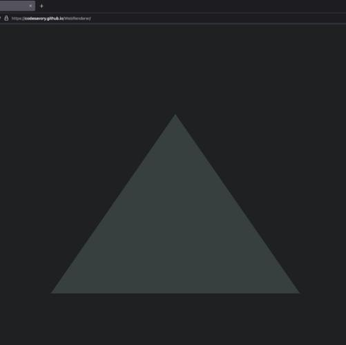

## Welcome to Suriya's Portfolio

I’m Suriya, currently a Software Engineer at MathWorks, where I work on camera modeling and simulation. My main passion is computer graphics—especially rendering, lighting, and real-time imaging. Recently, I’ve been exploring augmented reality and computational photography, building projects that blend graphics and machine learning. This space has taught me a lot, and I enjoy sharing my work and learning from others. Feedback is always welcome!

## Projects

### Graphics: Web and Machine Learning
1. [Gaussian Renderer](https://github.com/codesavory/GaussianRenderer)
2. [Web Renderer](https://github.com/codesavory/WebRenderer)
3. [3D Animatable Avatars](https://github.com/codesavory/3DAnimatableAvatars)

  
  

  

### Rendering
1. [Rasterization](pages/raster.md)
2. [Ray Tracing](pages/raytracer.md)
3. [Path Tracing](pages/pathtracer.md)

    
    
    

### AR/VR Pipeline
1. [Real-time Face Relighting](pages/realtime_relighting.md)
2. [Realitic 3D Avatars](pages/imageimate.md)

    
    

### Procedural Generation
1. [Houdini Simulations](pages/houdini.md)
2. [Houdini Pyro Infection System](pages/houdiniInfectionSystem.md)
3. [Houdini Cloth Simulation](pages/houdiniClothSimulation.md)

    

    
    

### Contact

Please feel free to reach out to me at [surya.dakshina@gmail.com](mailto:surya.dakshina@gmail.com)
