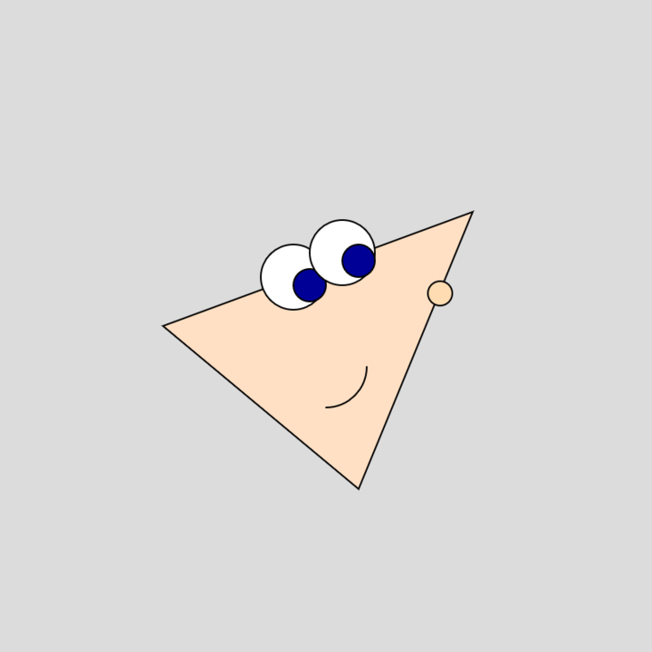
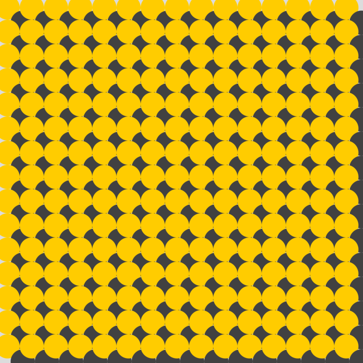

# Computational System for Visal Art and Design(CSVAD)

This work represents the work done during the coursework for CSVAD and shares the work across sketches, designs, patterns, colors, user inputs and computational systems.

[GitHub Code](https://github.com/CSVADW21/suriya)  

## Showing Progress across each week

### Week1 - Phineas Flynn

### Week2 - Grid Wallpaper

### Week3 - I (x^2 + 9/4y^2 + z^2 - 1)^3 -x^2z^3 - 9/200y^2z^3 you.

### Week4 - The Pensieve from Harry Potter

### Week5 - Air Brush

### Week6 - RGB Color Tesseract

### Final Project - Isometric Voxel Building/Painting Tool

