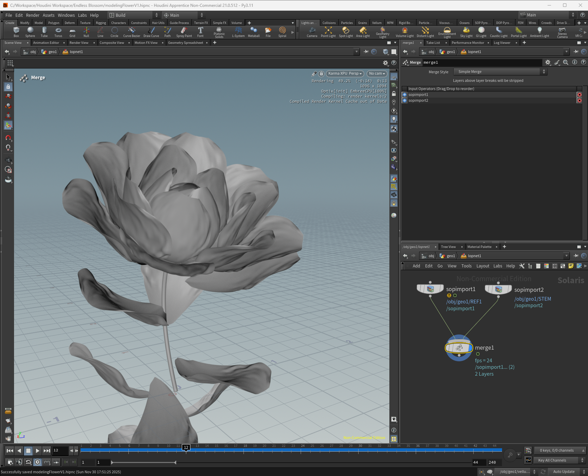
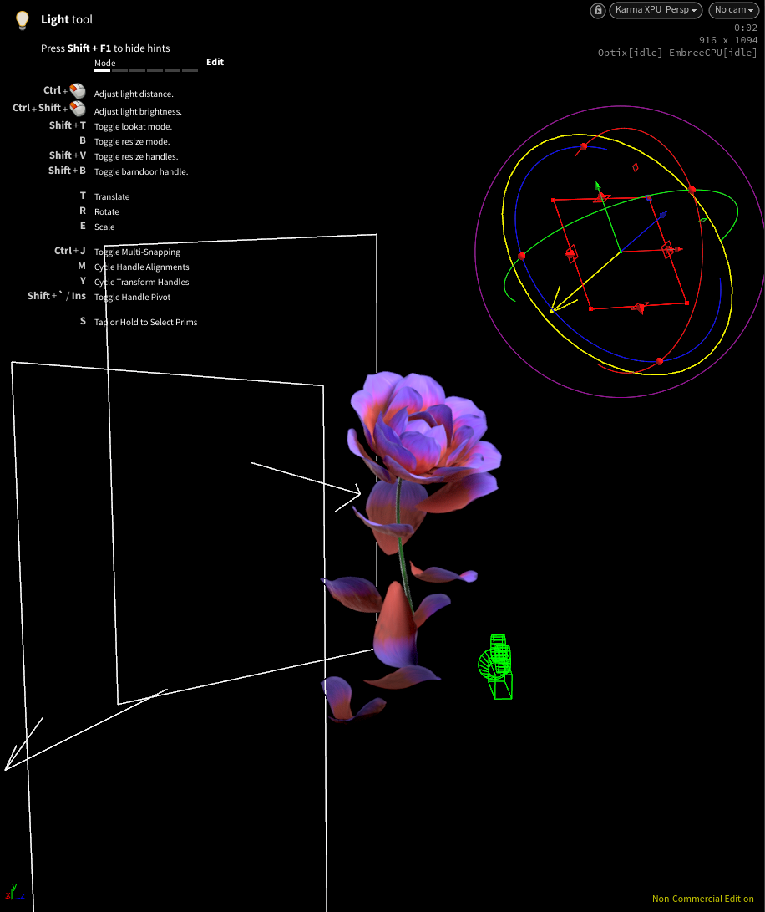
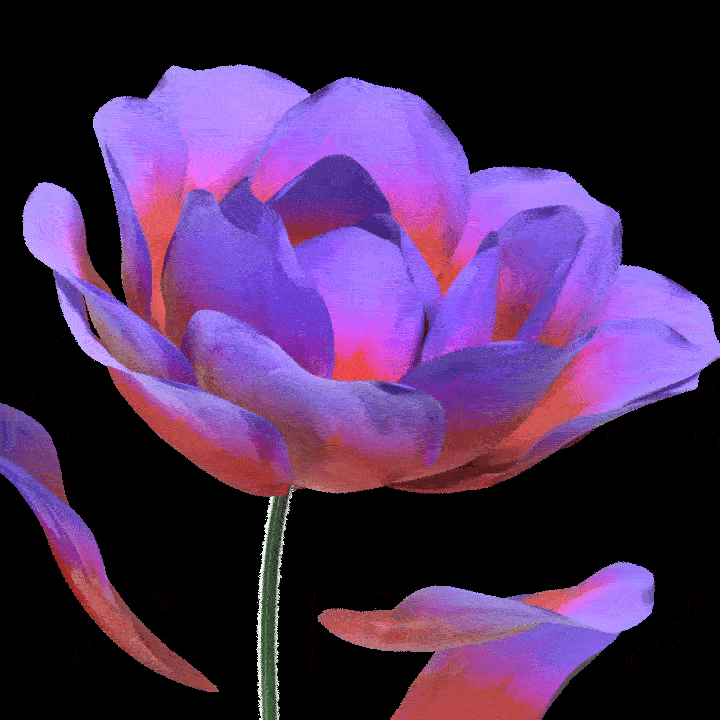

# Houdini Endless Blossom

This work shares my Houdini learning experience -- Vellum, COPs, and Feather SOP.

Inspired by [Christopher Kopic from Entagma](https://www.youtube.com/watch?v=ypJL4PXxQpg)
 
1. Vellum Cloth - To simulate realistic petals blooming
2. Feather SOP - Leveraging Feather SOP in H21 for modeling a single petal
3. COPs - For texturing the petals in detail
4. Karma - Rendered entirely in Karma
 

## Modeling 

## Lighting 

## Simulation 

 
