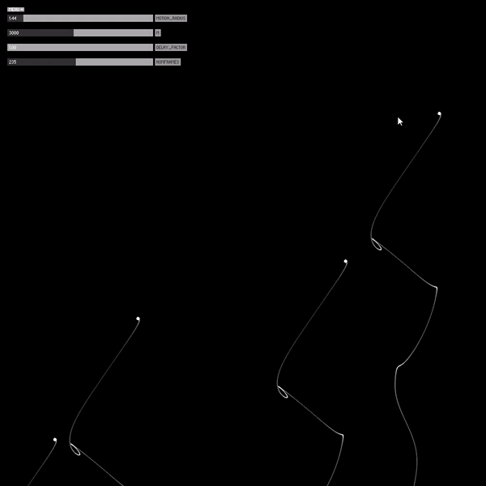

# Houdini Simulations

This work shares my Houdini learning experience and some of the Houdini SOPs I have explored.

## Showing Progress across each week

### Week4 - The Pensieve from Harry Potter
<!---  -->

### Week5 - Air Brush

### Week6 - RGB Color Tesserac

