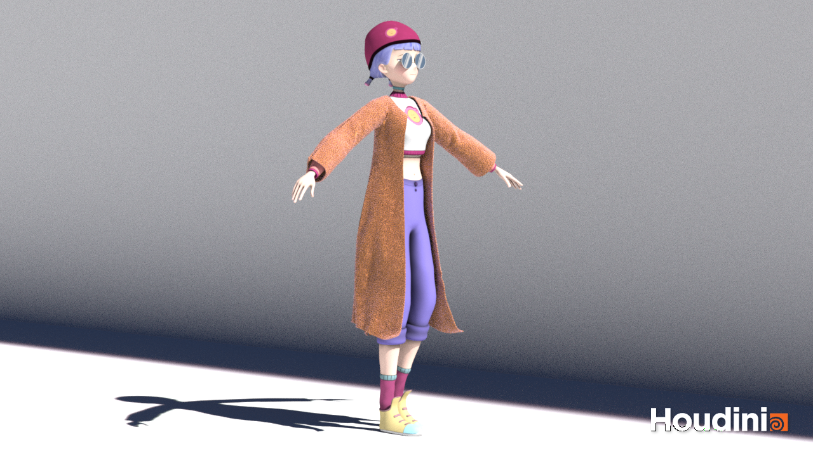
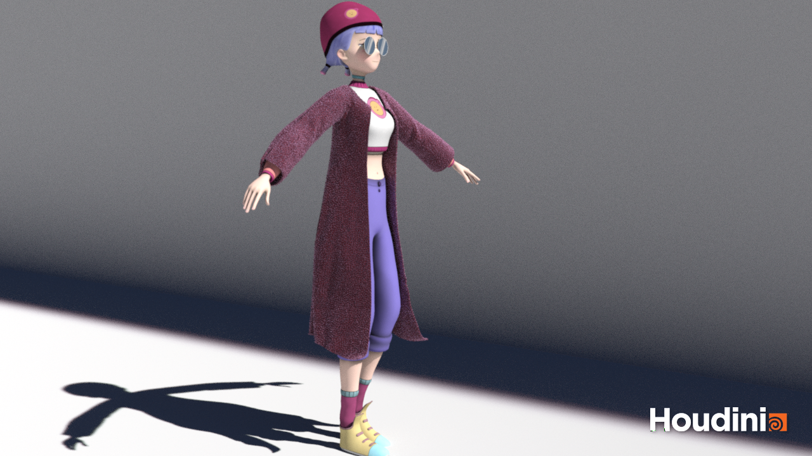
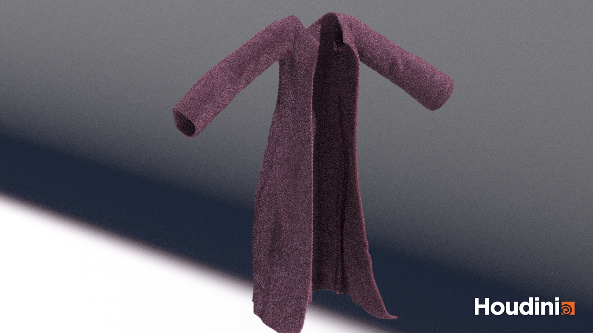

# Houdini Cloth Simulation

This work shares my Houdini learning experience - KineFX, Vellum Drape, MaterialX, and Karma.

Inspired by [Ronald Fong Tutorial](https://youtu.be/Z9eqknbHjJY?si=q1lTmFvTsDdWb9ID)
 
1. Vellum Drape - Using the Vellum Drape constraints to model and stitch the cardigan
2. KineFX - Bringing animation loops from Mixamo and interacting with the Drape
3. Textures - Modeling heightmaps onto cardigans using displacement maps in MaterialX
4. MaterialX and Karma - Materials built using MtlX sheen and rendered using Karma in Solaris
 
Walking interaction with Cloth Simulation 
Orange Cardigan 
Purple Cardigan 
Cardigan Sheen and Wool Texture 
 
