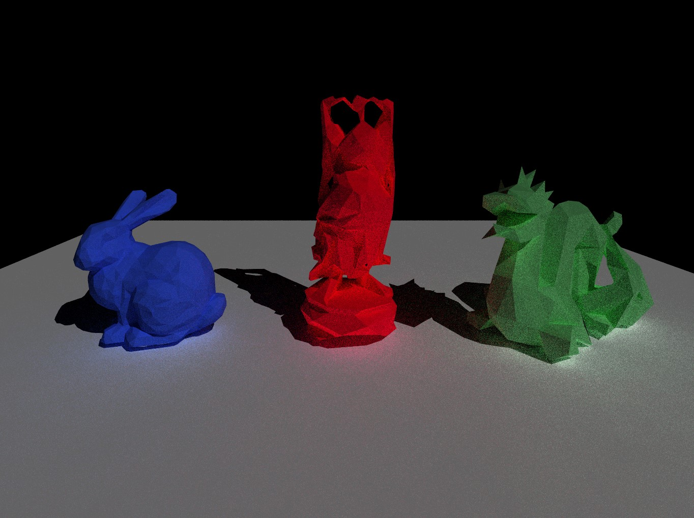

## Path Tracing Project

Extendering the rendering technique of ray tracing to unbiased monte carlo based path tracer.

GitHub Repo - [https://github.com/codesavory/PathTracer_Course/](https://github.com/codesavory/PathTracer_Course/)

*Extension of the ray tracer from - [https://github.com/codesavory/RayTracer_Course/](https://github.com/codesavory/RayTracer_Course/)

### Implemented - 

    1. Monte-Carlo based Hemispherical Sampling.
    2. Multiple-Importance Sampling of light and BRDF.

### Results - 
   Bunny, dragon & buddha scene rendered using MIS Path Tracer with 16spp:
    
   
   
   Cornell Box scene rendered using MIS Path Tracer with 16spp (Res: 1500px X 1500px):
    
   ")
   
   Cornell Box scene rendered using Naive Path Tracer with 16spp (Res: 500px X 500px):
    
   ")

###### *part of an acdemic project in advanced image synthesis.
