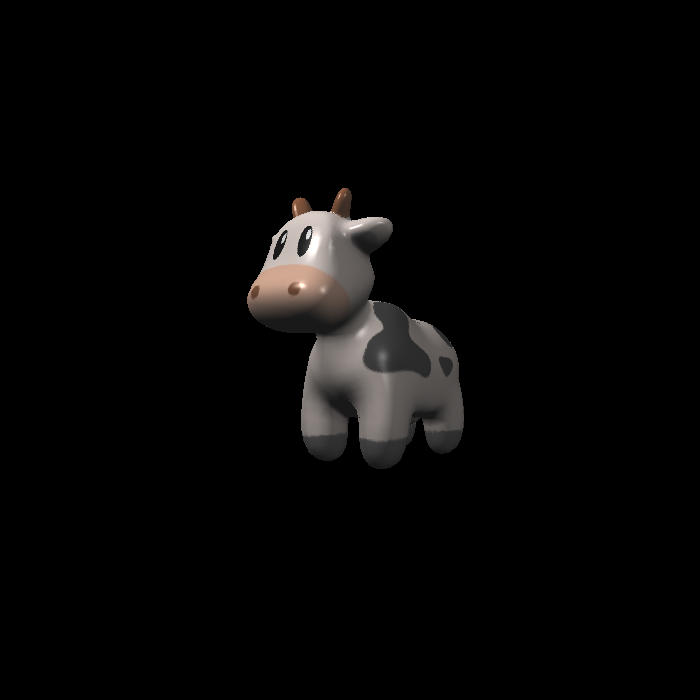
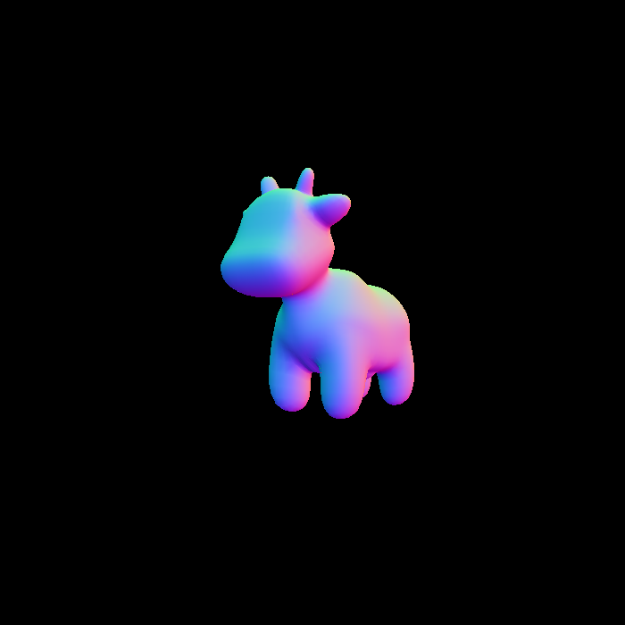

## Rasterization Project

Exploring the graphics pipeline using the rendering technique of rasterization.

### Implemented -
  Transformations and Projection
  Triangles and Z-Buffering
  Shading - Phong and Texture Mapping

### Existing Libraries -
  Object Loader created by Robert Smith - GitHub Repo

### Results -
  ##### Phong Shading
  
  
  
  
  
  
  
  
  
  

###### *part of an acdemic project in foundations of computer graphics.
