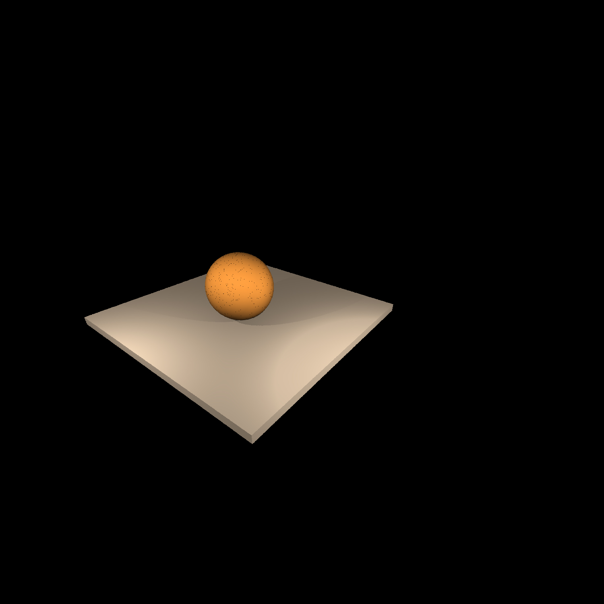
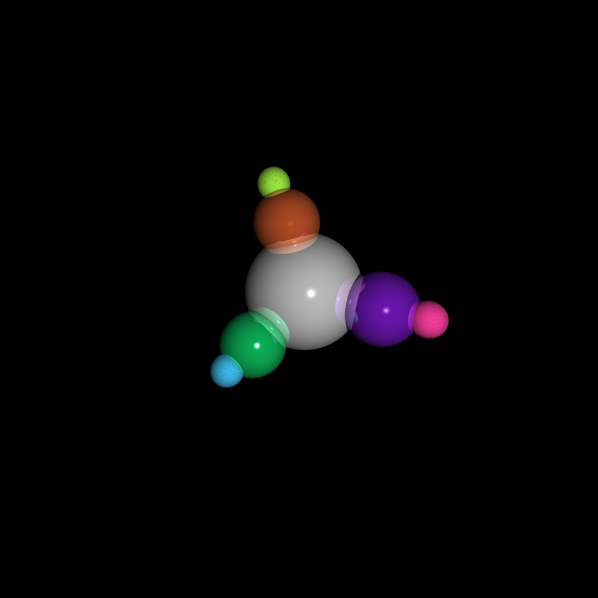
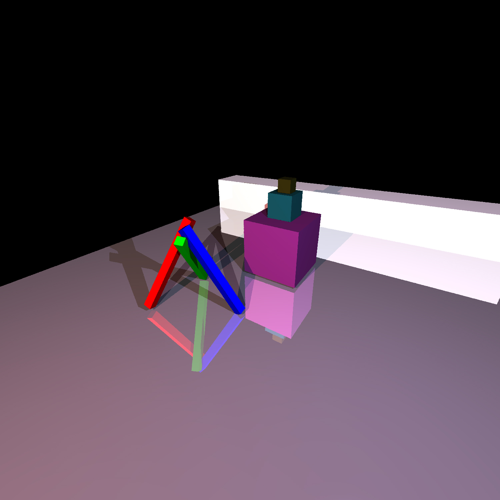
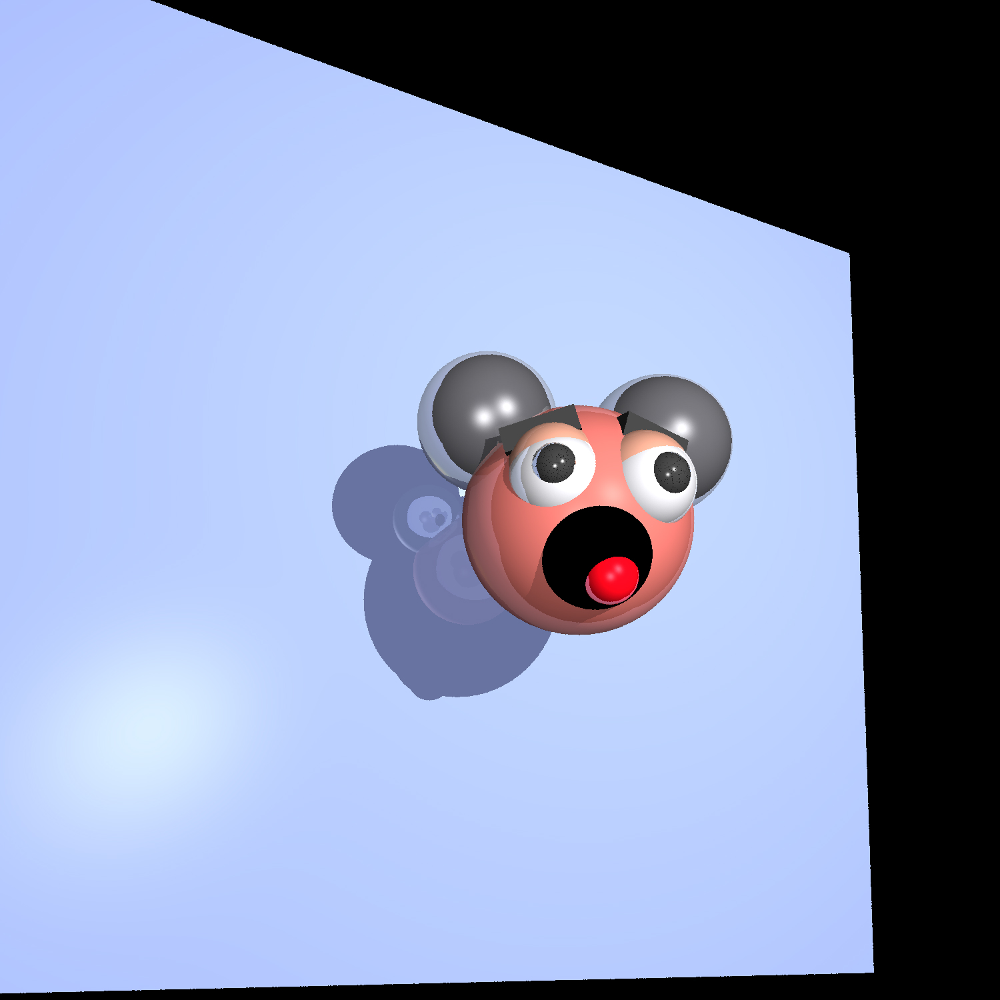
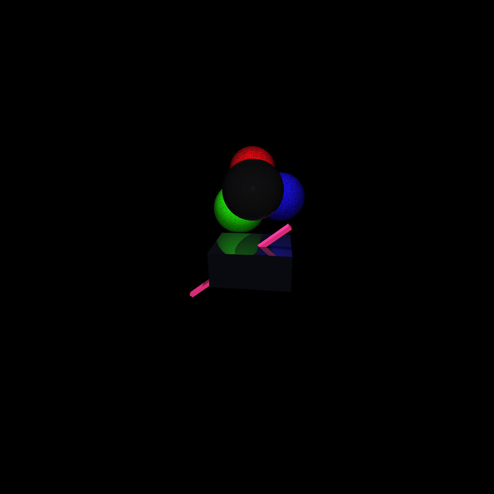

## Ray Tracing Project

Exploring the rendering technique of ray tracing for high quality offline rendering.

GitHub Repo - [https://github.com/codesavory/RayTracer_Course.git](https://github.com/codesavory/RayTracer_Course.git)

### Implemented - 
    1. Camera, Light and Material models.
    2. Ray routine - creation, traversal.
    3. Ray-triangle, Ray-Sphere Intersection.
    4. Bounding Volume Hierarchy(BVH) acceleration.

### Existing Libraries -
    1. Scene Reader - The scene descriptions are originally from Inventor applications(a toolkit provided by SGI) by Brian L. Curless, Eric Veach.
    2. Object Loader - A Single Header OBJ Model Loader by Robert Smith - https://github.com/Bly7/OBJ-Loader

### Results -
   Scene1:
   
  
  
  Scene2:
   
  
  
  Scene3:
   
  
  
  Scene4:
   
  
  
  Scene5:
   
  
  
###### *part of an acdemic project in advanced image synthesis.
